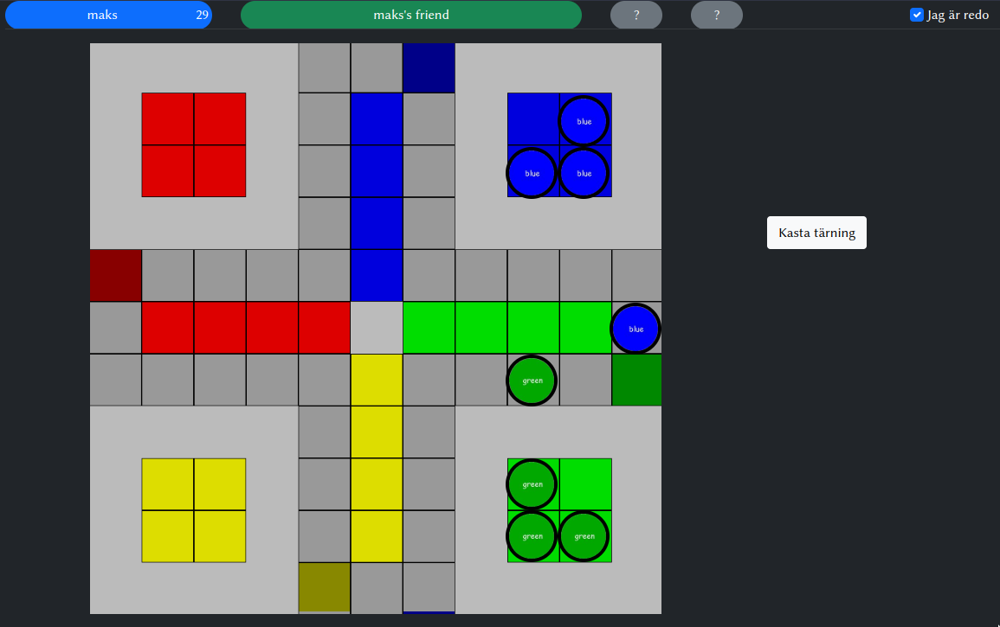

# Fia
## Onlineversion av det klassiska brädspel "Fia"

Features:
- Classical and beloved gameplay
- Allows you to play with friends over the internet
- Disables simple cheating
- Simple UI

## Start instructions
To start:
- import /fia.sql and set database name and credentials in /public/php/dbCredentials.php
- install node modules with `pnpm install`
- set secure SESSION_KEY in /start-node
- set secure API_KEY in /public/php/dbCredentials.php
- run `start-node` in /
- and `start-php` in / simultaneously in another terminal

